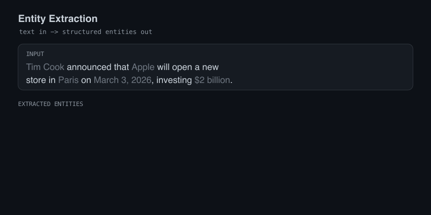
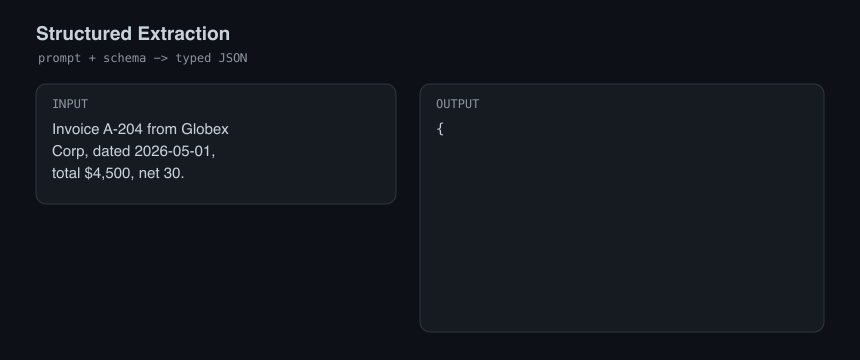
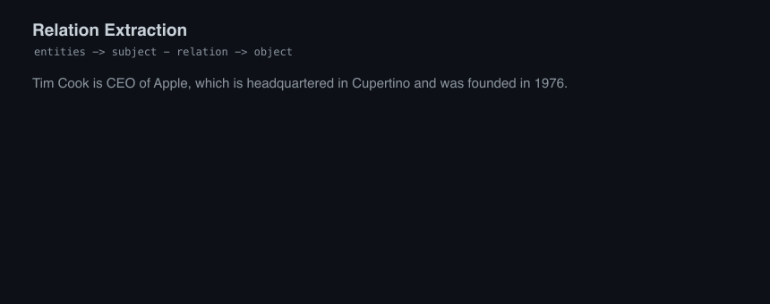
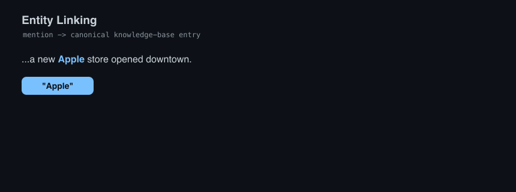
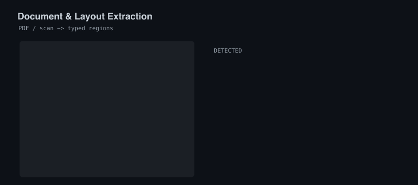

# Awesome Entity Extraction 

> A curated, **LLM-era** list of tools, models, libraries, and resources for
> extracting entities, relations, and structured data from unstructured text.

Most "entity extraction" lists were written for the 2018 NLP world — CRFs,
BiLSTMs, and paper dumps. The field has changed: zero-shot taggers, LLM
structured outputs, and graph extraction now do in one prompt what used to take
a labeled corpus and a training run. This list is **practitioner-first** and
**kept current**: every entry links to a real, maintained project, and a CI job
re-checks every link weekly.

*Entity extraction* here covers the whole family: Named Entity Recognition
(NER), relation/knowledge extraction, structured-data extraction from text and
documents, entity linking, PII detection, and the annotation/eval tooling
around it.

## Contents

- [Libraries and Frameworks](#libraries-and-frameworks)
- [LLM-Based and Structured Extraction](#llm-based-and-structured-extraction)
- [Zero-Shot and Modern NER Models](#zero-shot-and-modern-ner-models)
- [Ready-to-Use Models (Hugging Face)](#ready-to-use-models-hugging-face)
- [Relation and Knowledge Extraction](#relation-and-knowledge-extraction)
- [Entity Linking](#entity-linking)
- [Multilingual Extraction](#multilingual-extraction)
- [Document and Layout Extraction](#document-and-layout-extraction)
- [Temporal, Numeric, and Pattern Extraction](#temporal-numeric-and-pattern-extraction)
- [Specialized Extraction](#specialized-extraction)
- [Annotation and Evaluation Tools](#annotation-and-evaluation-tools)
- [Datasets and Benchmarks](#datasets-and-benchmarks)
- [Tutorials and Learning](#tutorials-and-learning)

## Libraries and Frameworks

General-purpose NLP toolkits with strong, production-grade NER components.

- [spaCy](https://github.com/explosion/spaCy) - Industrial-strength NLP in Python; fast, trainable NER pipelines and the `spancat` component for overlapping spans.
- [Hugging Face Transformers](https://github.com/huggingface/transformers) - The model hub and library behind most modern token-classification (NER) models.
- [Flair](https://github.com/flairNLP/flair) - Simple framework with state-of-the-art sequence taggers and contextual string embeddings.
- [Stanza](https://github.com/stanfordnlp/stanza) - Stanford NLP's neural pipeline with NER for 60+ languages.
- [Stanford CoreNLP](https://github.com/stanfordnlp/CoreNLP) - The long-standing Java NLP suite with rule-based and statistical NER.
- [HanLP](https://github.com/hankcs/HanLP) - Multilingual NLP toolkit with strong NER, especially for Chinese.
- [Spark NLP](https://github.com/JohnSnowLabs/spark-nlp) - Scalable NLP for Apache Spark with a large catalog of pretrained NER models.
- [PaddleNLP](https://github.com/PaddlePaddle/PaddleNLP) - Broad NLP library with information-extraction (UIE) pipelines.
- [NLTK](https://github.com/nltk/nltk) - The classic Python NLP toolkit; useful for chunking-based entity extraction and teaching.
- [nlp.js](https://github.com/axa-group/nlp.js) - NLP library for Node.js with built-in entity extraction.

## LLM-Based and Structured Extraction

The modern default: prompt a model and get back typed, validated structures.

- [LangExtract](https://github.com/google/langextract) - Google's library for extracting structured information from text with LLMs, including source grounding.
- [Instructor](https://github.com/567-labs/instructor) - Structured LLM outputs via Pydantic schemas; the de-facto way to extract typed entities.
- [Outlines](https://github.com/dottxt-ai/outlines) - Constrained/structured generation that guarantees the model emits valid schemas.
- [GraphRAG](https://github.com/microsoft/graphrag) - Microsoft's pipeline that extracts entities and relationships from text to build a knowledge graph for RAG.
- [Guidance](https://github.com/guidance-ai/guidance) - Programming paradigm for steering LLMs, including constrained output for reliable extraction.
- [Guardrails](https://github.com/guardrails-ai/guardrails) - Adds structure, type, and quality guarantees to LLM outputs.
- [BAML](https://github.com/BoundaryML/baml) - A language for writing typed LLM functions; strong for schema-first extraction.
- [Marvin](https://github.com/PrefectHQ/marvin) - AI toolkit that turns text into structured Python objects with minimal code.
- [Haystack](https://github.com/deepset-ai/haystack) - LLM orchestration framework with extractive components and structured-output support.
- [kor](https://github.com/eyurtsev/kor) - Prompt-based structured extraction helper for LLMs (LangChain-friendly).
- [spacy-llm](https://github.com/explosion/spacy-llm) - Drop LLM prompts into spaCy pipelines for zero/few-shot NER with no training.
- [Zerox](https://github.com/getomni-ai/zerox) - OCR-then-LLM pipeline that turns documents (PDFs, images) into structured data.
- [jsonformer](https://github.com/1rgs/jsonformer) - Generate guaranteed-valid JSON from LLMs by only sampling the schema's content tokens.
- [lm-format-enforcer](https://github.com/noamgat/lm-format-enforcer) - Enforce JSON Schema / regex output formats during generation.

## Zero-Shot and Modern NER Models

Tag arbitrary entity types with little or no task-specific training.

- [GLiNER](https://github.com/urchade/GLiNER) - Generalist, lightweight model that recognizes any entity type from a label list — zero-shot, runs on CPU.
- [UniversalNER](https://github.com/universal-ner/universal-ner) - Distilled open models targeting open-domain, instruction-following NER.
- [SpanMarker](https://github.com/tomaarsen/SpanMarkerNER) - Framework for training strong span-marker NER models on top of any encoder.
- [GoLLIE](https://github.com/hitz-zentroa/GoLLIE) - Code-LLM that performs zero-shot extraction by following annotation guidelines.
- [Zshot](https://github.com/IBM/zshot) - IBM's zero/few-shot entity and relation extraction framework that plugs into spaCy.

**Choosing an approach** — a quick, opinionated map (not a benchmark — pick by fit):

| Approach                        | Zero-shot | Training needed | Best for                                   |
| ------------------------------- | --------- | --------------- | ------------------------------------------ |
| **GLiNER**                      | Yes       | No              | Fast custom entity types, on-device / CPU  |
| **SpanMarker**                  | No        | Yes (fine-tune) | High accuracy on a fixed, known schema     |
| **UniversalNER / GoLLIE**       | Yes       | No              | Open-domain or guideline-driven extraction |
| **spaCy (trainable)**           | No        | Yes             | Production pipelines with your own labels  |
| **LLM + Instructor / Outlines** | Yes       | No              | Arbitrary structured fields, messy inputs  |

## Ready-to-Use Models (Hugging Face)

Pretrained checkpoints you can `pip install transformers` and run today. Pick by
entity types, language, and size.

- [GLiNER multi v2.1](https://huggingface.co/urchade/gliner_multi-v2.1) - Multilingual zero-shot GLiNER; name any entity types at inference time.
- [GLiNER large v2.1](https://huggingface.co/urchade/gliner_large-v2.1) - Larger English-focused GLiNER for higher zero-shot accuracy.
- [UniNER-7B-all](https://huggingface.co/Universal-NER/UniNER-7B-all) - UniversalNER 7B instruction model for open-domain zero-shot NER.
- [GoLLIE-7B](https://huggingface.co/HiTZ/GoLLIE-7B) - Guideline-following extraction model based on Code-LLaMA.
- [NuExtract 1.5](https://huggingface.co/numind/NuExtract-1.5) - Small, fine-tunable model for template-based structured extraction.
- [NuExtract 2.0 8B](https://huggingface.co/numind/NuExtract-2.0-8B) - Larger NuExtract for higher-accuracy structured extraction.
- [NuNER Zero](https://huggingface.co/numind/NuNER_Zero) - Compact zero-shot token-classification NER model.
- [bert-base-NER](https://huggingface.co/dslim/bert-base-NER) - Classic, reliable English NER baseline (CoNLL-03 types).
- [bert-large-NER](https://huggingface.co/dslim/bert-large-NER) - Larger variant of the classic English NER baseline.
- [roberta-large-ner-english](https://huggingface.co/Jean-Baptiste/roberta-large-ner-english) - Strong English NER fine-tuned on RoBERTa-large.
- [flair/ner-english-large](https://huggingface.co/flair/ner-english-large) - High-accuracy English NER from the Flair team.

## Relation and Knowledge Extraction

Beyond spans: pull relationships and triples to build knowledge graphs.

- [DeepKE](https://github.com/zjunlp/DeepKE) - Knowledge-extraction toolkit for NER, relation, and attribute extraction (standard, low-resource, document-level).
- [OpenNRE](https://github.com/thunlp/OpenNRE) - Open-source package for neural relation extraction.
- [REBEL](https://github.com/Babelscape/rebel) - Relation extraction as end-to-end seq2seq, jointly extracting entities and relations.
- [rebel-large (model)](https://huggingface.co/Babelscape/rebel-large) - Ready-to-run REBEL checkpoint for end-to-end relation extraction.

## Entity Linking

Resolve mentions to canonical knowledge-base entries (e.g. Wikidata).

- [BLINK](https://github.com/facebookresearch/BLINK) - Entity linking over Wikipedia using a bi-encoder + cross-encoder architecture.
- [GENRE](https://github.com/facebookresearch/GENRE) - Autoregressive entity retrieval/linking that generates the entity name.
- [ReFinED](https://github.com/amazon-science/ReFinED) - Fast, end-to-end entity linking that resolves and types mentions in one pass.

## Multilingual Extraction

Entity extraction beyond English.

- [T-NER](https://github.com/asahi417/tner) - Python library and model zoo for multilingual NER with Transformers.
- [WikiNEuRal](https://github.com/Babelscape/wikineural) - Multilingual NER dataset and models combining neural and knowledge-based silver data.
- [xlm-roberta-base-ner-hrl (model)](https://huggingface.co/Davlan/xlm-roberta-base-ner-hrl) - NER across 10 high-resource languages on XLM-RoBERTa.
- [wikineural-multilingual-ner (model)](https://huggingface.co/Babelscape/wikineural-multilingual-ner) - Multilingual NER model covering nine languages.
- [bert-base-multilingual-cased-ner-hrl (model)](https://huggingface.co/Davlan/bert-base-multilingual-cased-ner-hrl) - Multilingual BERT NER across 10 high-resource languages.

## Document and Layout Extraction

Get entities and structured data out of PDFs, scans, and complex layouts.

- [Docling](https://github.com/docling-project/docling) - Parse PDFs, DOCX, and more into structured, AI-ready document representations.
- [Marker](https://github.com/datalab-to/marker) - Convert PDFs and documents to clean Markdown/JSON with high fidelity.
- [Unstructured](https://github.com/Unstructured-IO/unstructured) - Pre-processing library that extracts text and elements from many document types.
- [Surya](https://github.com/datalab-to/surya) - OCR, layout, reading-order, and table detection across 90+ languages.
- [Nougat](https://github.com/facebookresearch/nougat) - Transformer model that converts scientific PDFs (incl. math) to markup.
- [LayoutParser](https://github.com/Layout-Parser/layout-parser) - Deep-learning toolkit for document image layout analysis.
- [Donut](https://github.com/clovaai/donut) - OCR-free document understanding transformer for parsing and extraction.
- [Table Transformer](https://github.com/microsoft/table-transformer) - Detect and extract tables (and their structure) from documents.
- [pdfplumber](https://github.com/jsvine/pdfplumber) - Extract text, tables, and shapes from PDFs with fine-grained control.
- [Camelot](https://github.com/camelot-dev/camelot) - Extract tables from text-based PDFs into DataFrames.
- [spacy-layout](https://github.com/explosion/spacy-layout) - Bring Docling-parsed document layout into spaCy pipelines.

## Temporal, Numeric, and Pattern Extraction

Extract dates, times, quantities, and rule-based patterns.

- [dateparser](https://github.com/scrapinghub/dateparser) - Parse dates and times from human-readable text in many languages.
- [Duckling](https://github.com/facebook/duckling) - Facebook's rule-based parser for dates, times, numbers, amounts, and durations.
- [quantulum3](https://github.com/nielstron/quantulum3) - Extract quantities, units, and measurements from unstructured text.
- [HeidelTime](https://github.com/HeidelTime/heideltime) - Multilingual, cross-domain temporal tagger for normalized time expressions.

## Specialized Extraction

Domain- and type-specific extraction.

- [Presidio](https://github.com/microsoft/presidio) - Microsoft's PII detection and de-identification for text and images.
- [scispaCy](https://github.com/allenai/scispacy) - spaCy models for biomedical, scientific, and clinical entity extraction.
- [medspaCy](https://github.com/medspacy/medspacy) - Clinical NLP with spaCy, including context and section detection.
- [KeyBERT](https://github.com/MaartenGr/KeyBERT) - Keyword and keyphrase extraction using BERT embeddings.
- [pke](https://github.com/boudinfl/pke) - Python keyphrase-extraction toolkit (supervised and unsupervised).
- [biomedical-ner-all (model)](https://huggingface.co/d4data/biomedical-ner-all) - Recognizes 100+ biomedical entity types out of the box.
- [Medical-NER (model)](https://huggingface.co/blaze999/Medical-NER) - DeBERTa-based clinical NER covering a wide range of medical entities.
- [gliner_large_bio (model)](https://huggingface.co/urchade/gliner_large_bio-v0.1) - Zero-shot GLiNER tuned for biomedical entities.
- [gliner_multi_pii (model)](https://huggingface.co/urchade/gliner_multi_pii-v1) - Zero-shot GLiNER specialized for detecting PII entity types.
- [deberta_finetuned_pii (model)](https://huggingface.co/lakshyakh93/deberta_finetuned_pii) - DeBERTa model fine-tuned to detect a broad set of PII fields.

## Annotation and Evaluation Tools

You still need labeled data for evaluation and fine-tuning.

- [Label Studio](https://github.com/HumanSignal/label-studio) - Multi-type data labeling platform with strong NER/span annotation.
- [doccano](https://github.com/doccano/doccano) - Open-source text annotation tool for NER, classification, and sequence labeling.
- [Argilla](https://github.com/argilla-io/argilla) - Collaboration platform for building and curating NLP/LLM datasets.
- [prodigy-recipes](https://github.com/explosion/prodigy-recipes) - Recipes and examples for Prodigy, the scriptable annotation tool from the spaCy team.
- [brat](https://github.com/nlplab/brat) - Classic web-based tool for rich text annotation, widely used for NER/relations.
- [INCEpTION](https://github.com/inception-project/inception) - Semantic annotation platform with active learning and knowledge-base linking.

## Datasets and Benchmarks

- [IEPile](https://github.com/zjunlp/IEPile) - Large-scale, bilingual information-extraction instruction corpus for training extraction models.
- [Few-NERD](https://github.com/thunlp/Few-NERD) - Large, fine-grained NER dataset with 66 entity types for few-shot evaluation.
- [CoNLL-2003 (dataset)](https://huggingface.co/datasets/eriktks/conll2003) - The canonical English NER benchmark (PER, ORG, LOC, MISC).
- [Few-NERD (dataset)](https://huggingface.co/datasets/DFKI-SLT/few-nerd) - Ready-to-load Few-NERD splits on the Hugging Face Hub.
- [MultiNERD](https://huggingface.co/datasets/Babelscape/multinerd) - Multilingual, multi-genre NER dataset spanning 10 languages.
- [WikiANN](https://huggingface.co/datasets/unimelb-nlp/wikiann) - Cross-lingual NER over 176 languages built from Wikipedia.
- [OntoNotes 5 (dataset)](https://huggingface.co/datasets/tner/ontonotes5) - Large multi-domain NER dataset with 18 entity types.
- [MultiCoNER v2](https://huggingface.co/datasets/MultiCoNER/multiconer_v2) - Complex, fine-grained multilingual NER benchmark.

## Tutorials and Learning

- [Transformers Tutorials](https://github.com/NielsRogge/Transformers-Tutorials) - Hands-on notebooks including token classification / NER with Transformers.

## Contributing

Contributions are welcome! Please read [CONTRIBUTING.md](CONTRIBUTING.md) first.
The one hard rule: **every entry must link to a real, maintained project** and
include a short, factual description. No dead links, no vaporware.

To the extent possible under law, the contributors have waived all copyright and
related or neighboring rights to this work.
